Title: Hic Sunt Dracones
Summary: Une collection de dragons dans les manuscrits médiévaux
Slug: 2025-08-30-hic-sunt-dracones
Author: Elisa Nury
Date: 2025-08-30
Category: Manuscripts
Featured_image: images/dragons/dragon1.jfif
Featured_image_caption: Bodleian, MS Mich. 619, f. 130r

Les dragons étaient une source d'inspiration sans fin pour les copistes qui décoraient les manuscrits de leurs plus belles enluminures ou de petits croquis griffonés dans les marges. Et ils sont magnifiques !

Voici (pour Sam) une collection de dragons manuscrits.

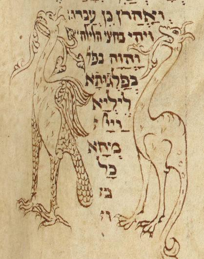
*Add. Ms. 26878 f.67v, partagé par [@SephardiPal](https://x.com/SephardiPal/status/591560356448837632)*

### Dragons de toutes les formes et couleurs

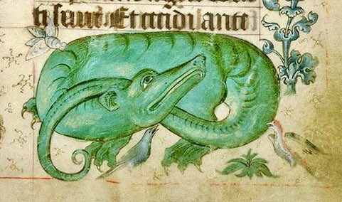
*Avignon MS 29, partagé par [@DamineKempf](https://x.com/DamienKempf/status/953907811431473152)*

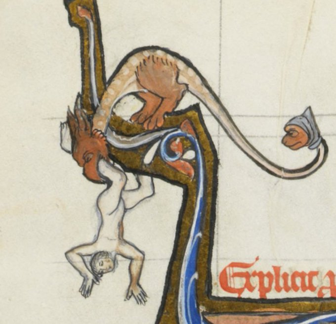
*Lausanne, Bibliothèque U 964 f.242r, partagé par [@Zweder_Masters](https://x.com/Zweder_Masters/status/891929153318125569)*

Ce dragon qui empêche un personnage de tomber du haut du D provient de la [Biblia Porta](https://www.e-codices.unifr.ch/en/list/one/bcul/U0964), une bible enluminée de la fin du 13e siècle. Cette bible est unique pour la qualité de ses illustrations, on y trouve de nombreux dragons comme par exemple ce magnifique dragon sauterelle ou bien ces deux jolis dragons qui décorent ce E majuscule.

*Lausanne, Bibliothèque U 964 f.343r*

*Lausanne, Bibliothèque U 964 f.313r*

D'ailleurs les dragons se déplacent souvent deux par deux. Ceux qui ont une deuxième tête au bout de la queue sont des [amphisbènes](https://fr.wikipedia.org/wiki/Amphisb%C3%A8ne_(mythologie)).

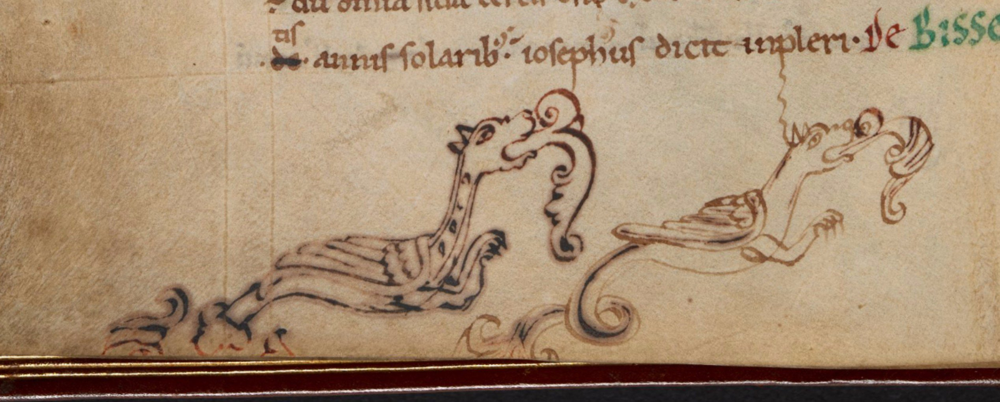
*Royal MS 13 A XI, partagé par [@FW_Medieval]https://x.com/FW_Medieval/status/884779561078140932*

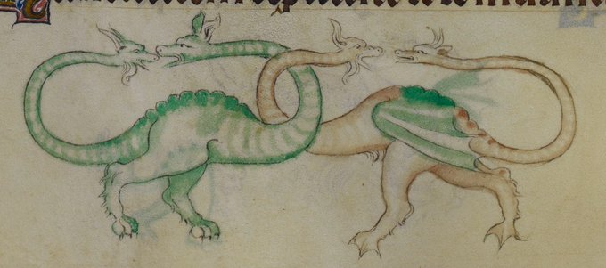
*British Library, Royal MS 2 B VII f.138v, partagé par [@Stewart_Brookes](https://x.com/Stewart_Brookes/status/1277664259745472515)*

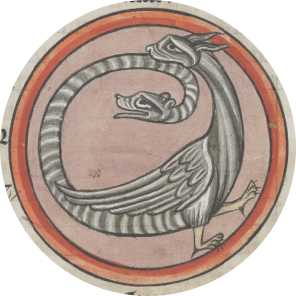
*Harley MS 4751, f.62r*

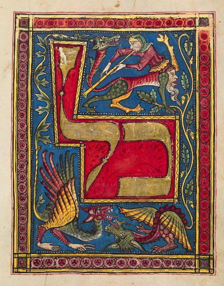
*MS. Michael 619, f.100v, partagé par [@Stewart_Brookes](https://x.com/Stewart_Brookes/status/1181592764842205184)*

Les dragons [micrographiques](https://essentiels.bnf.fr/fr/livres-et-ecritures/ecriture-et-art/067c8d73-10f3-4166-a3de-60d9b273d523-lettre-et-image/article/184cff14-dc10-4d0a-bf71-c736a50babda-micrographies-texte-travaille-comme-un-dessin
) se cachent dans les [bibles hébraïques](https://essentiels.bnf.fr/fr/livres-et-ecritures/les-systemes-ecriture/1dfb5fa0-5886-4a5c-9524-c795f11fcf97-alphabet-hebreu/article/69842197-0001-459e-a0da-6b4735d893f5-micrographie-hebraique-une-pratique-ecriture-insolite), en voici un exemple.

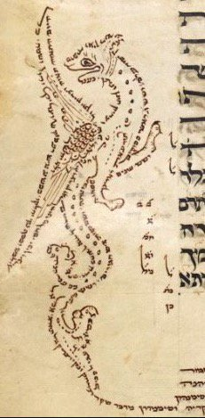
*British Library, Add MS 21160, f. 202r, partagé par [@SephardiPal](https://x.com/SephardiPal/status/785391166099382272)*

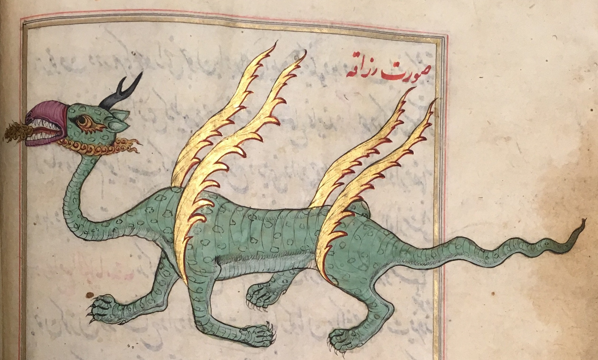
*Add MS 15241, partagé par [@BLAsia_Africa](https://x.com/BLAsia_Africa/status/839594962756976644)*

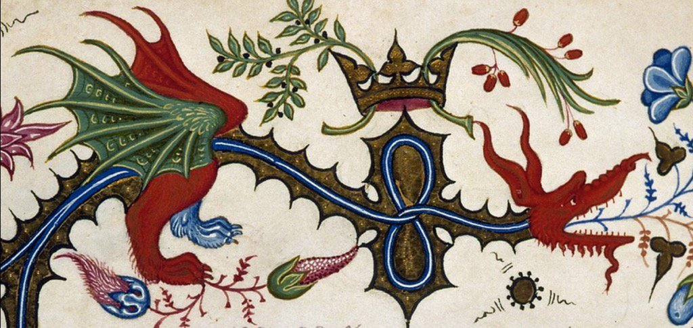
*Chambéry BM MS 4, partagé par [@DamienKempf](https://x.com/DamienKempf/status/741163804508229632)*

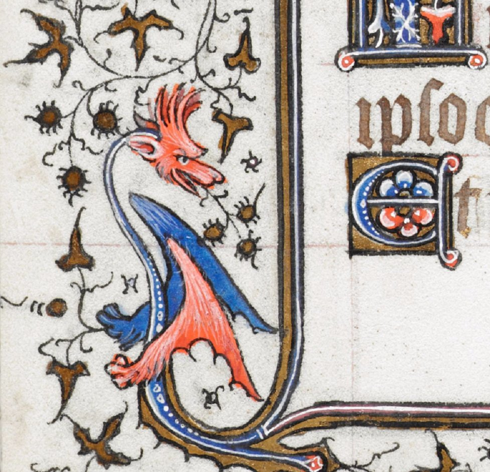
*Add Ms 82945 f.12r, partagé par [@BLMedieval](https://x.com/BLMedieval/status/731077059775078400)*

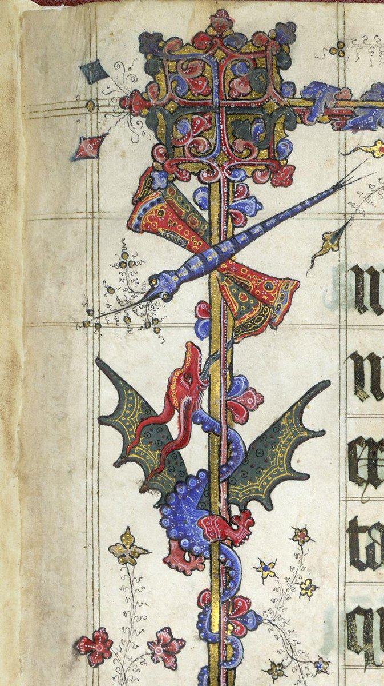
*Harley MS 7026 f.13r, partagé par [@OnlineMythIndia](https://x.com/OnlineMythIndia/status/636282978965024769)*

### Dragons volants

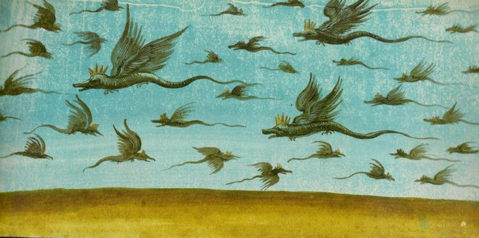
*Partagé par [@DamienKempf](https://x.com/DamienKempf/status/1247599316665077761)*

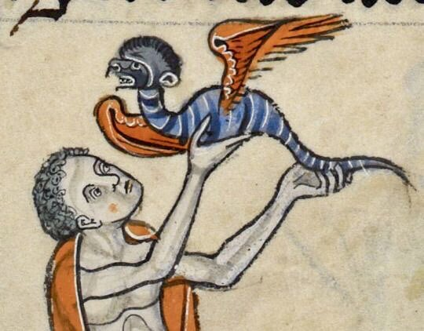
*BL Ruthland Psalter, partagé par [@DamienKempf](https://x.com/DamienKempf/status/1247183250029776897)*

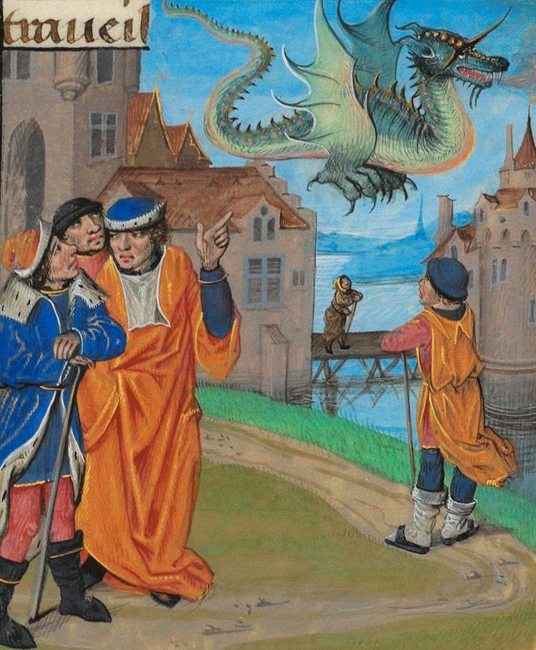
*BnF, MS Latin 7321A, partagé par [@DamienKempf](https://x.com/DamienKempf/status/1247380146627186688)*

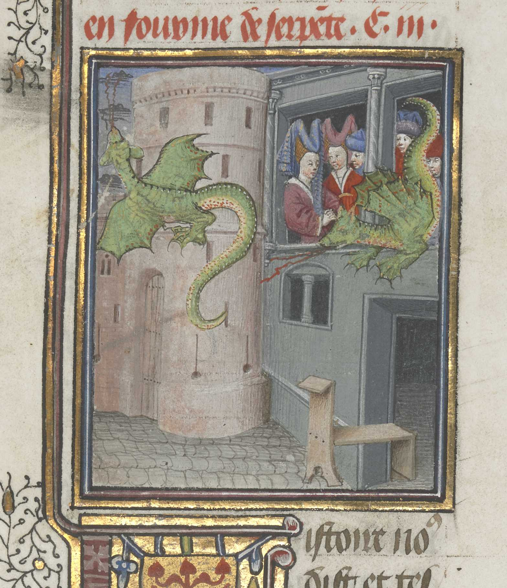
*Partagé par [@BLMedieval](https://x.com/BLMedieval/status/839460729744916481)*

### Dragons de compagnie

Qui n'aimerait pas avoir, comme sainte [Marguerite d'Antioche](https://fr.wikipedia.org/wiki/Marguerite_d%27Antioche), un de ces mignons dragons pour animal de compagnie ? 

*Morgan, MS M1078, partagé par [@DamienKempf](https://x.com/DamienKempf/status/964861076549533696)*

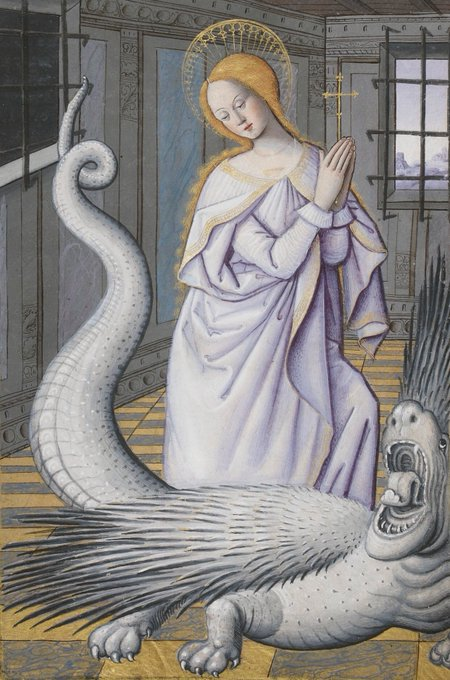
*BnF, Latin 1171, partagé par [@DamienKempf](https://x.com/DamienKempf/status/1247554011173130241)*

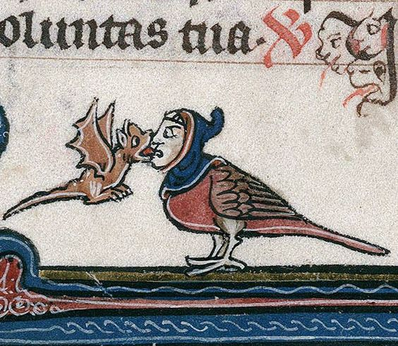
*Cambrai, Bibl Mun, ms. 102,  partagé par [@Zweder_Masters](https://x.com/Zweder_Masters/status/989399564552671232)*

Les activités du jour: jouer de la flûte, manger et dormir !

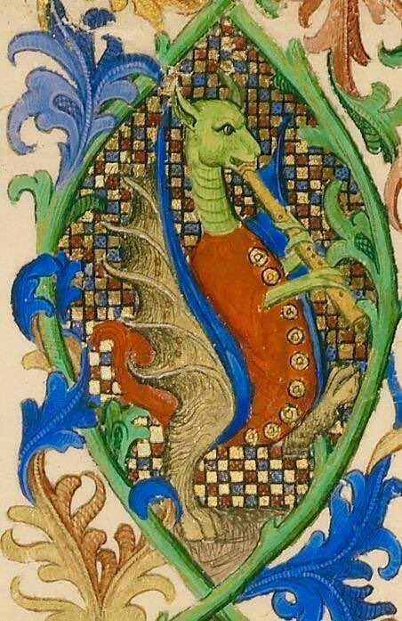
*Getty, MS 63, partagé par [@DamienKempf](https://x.com/DamienKempf/status/1247421513256431616)*

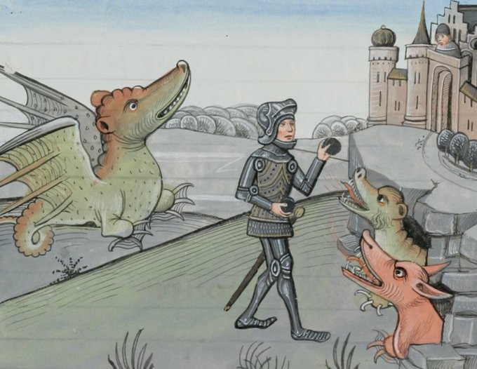
*Cologny, Cod. Bodmer 49 f.82v, partagé par [@DamienKempf](https://x.com/DamienKempf/status/997182507991949318)*

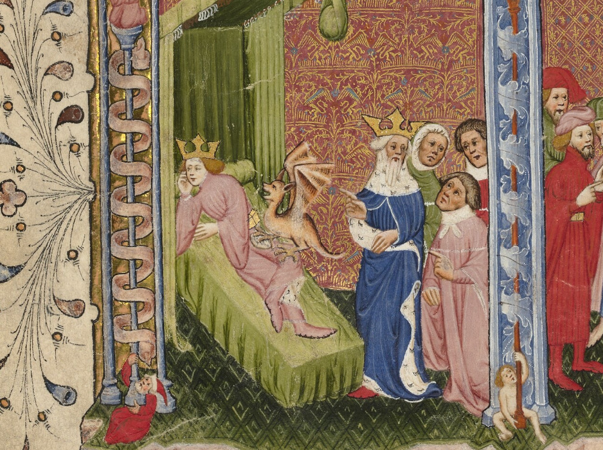
*Bodleian 264, f.2v.*

### Dragons affamés

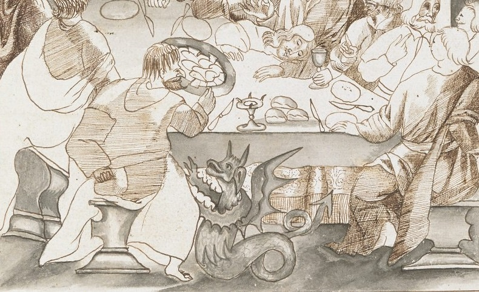
*Partagé par [@BL_AdiKS](https://x.com/BL_AdiKS/status/773185350101569536)*

Les [bestiaires](https://gallica.bnf.fr/accueil/fr/html/les-bestiaires-medievaux) [médiévaux](https://essentiels.bnf.fr/fr/livres-et-ecritures/histoire-du-livre-occidental/827cc9bf-5a3e-4180-886b-9974538a24b0-livre-medieval/article/85d9a9a5-f440-4c08-938c-49f909b9b36c-bestiaires-medievaux) nous apprennent que les dragons surchauffaient en crachant du feu, et [se rafraîchissaient](https://blogs.bl.uk/digitisedmanuscripts/2017/06/stay-cool-.html) en mangeant les éléphants réputés pour leur sang froid. 

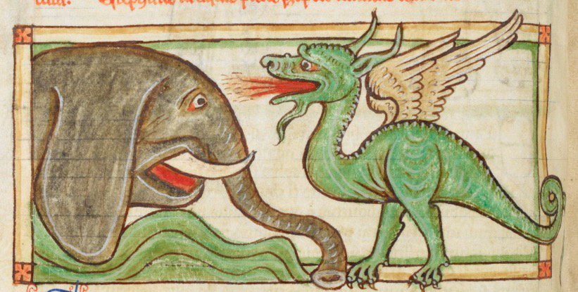
*Add. ms 11390, f.13r, partagé par [@Stewart_Brookes](https://x.com/Stewart_Brookes/status/704729767443038208)*

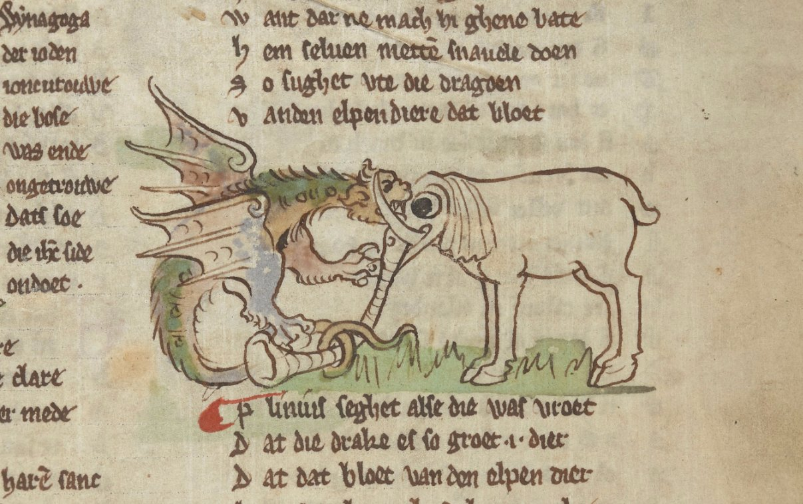
*Add. ms 11390, f.13r, partagé par [@BLMedieval](https://x.com/BLMedieval/status/877075843142610946)*

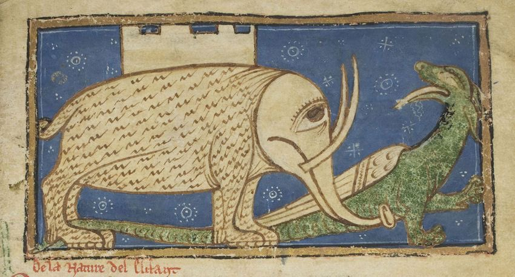
*Trinity College Library, O.2.14, f.60r, partagé par [@DannyDutch](https://x.com/DannyDutch/status/1313212016719466496)*

Après avoir mangé un éléphant, pas étonnant que ce dragon soit bien dodu !

*Partagé par [@Zweder_Masters](https://x.com/Zweder_Masters/status/606057065941999616)*

### Dragon ou Dino

Dragon ou [dinosaure](https://x.com/SephardiPal/status/777767955652186112) ? Celui-là en tout cas ressemble bien à un vélociraptor !

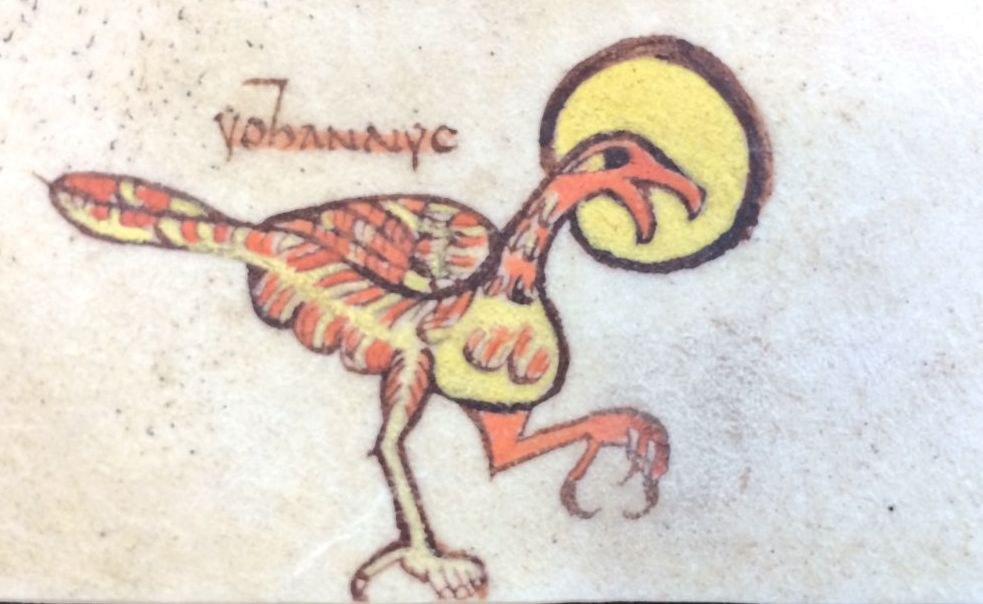
*HB VII 4 f.131r, partagé par [@Calthalas](https://x.com/Calthalas/status/991607365215629312)*

### Un dragon pas très médiéval

Et pour finir, un petit dragon qui se cache parmi les plantes: il s'agit de l'image de fond utilisée pour le blog qui provient de "Die Pflanze in Kunst und Gewerbe" d'Anton Seder.

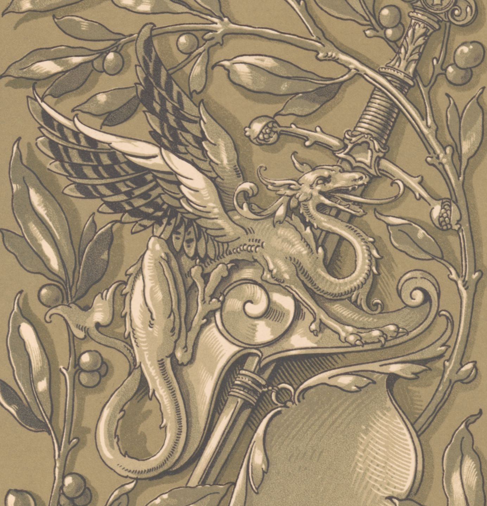
*Anton Seder 1887, Die Pflanze [...] vol. 1, planche 76. [Voir en ligne](https://digital.ulb.hhu.de/ihd/content/pageview/3870791)*

